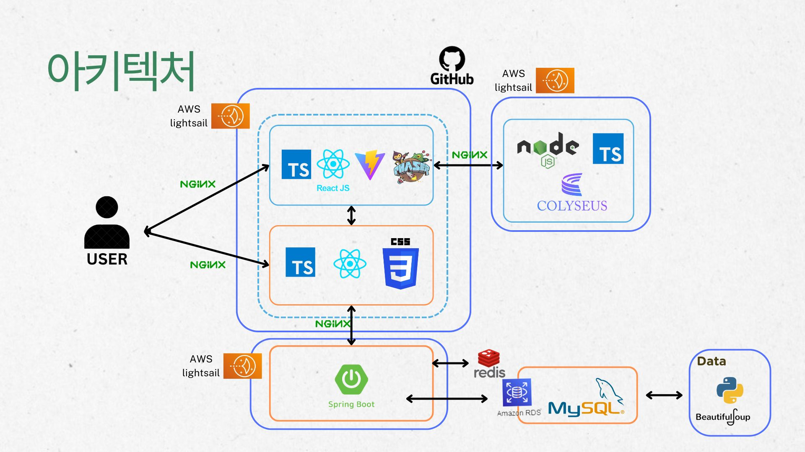
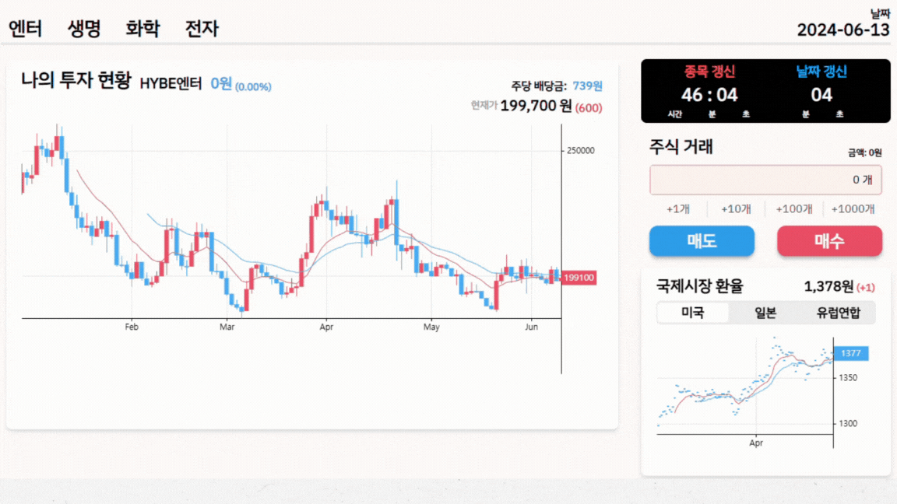
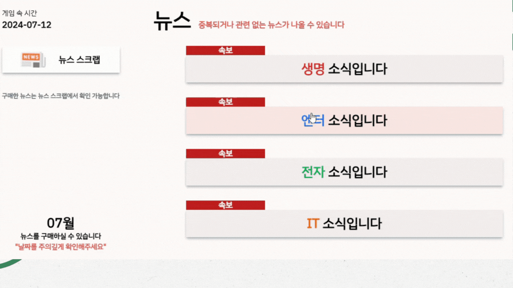
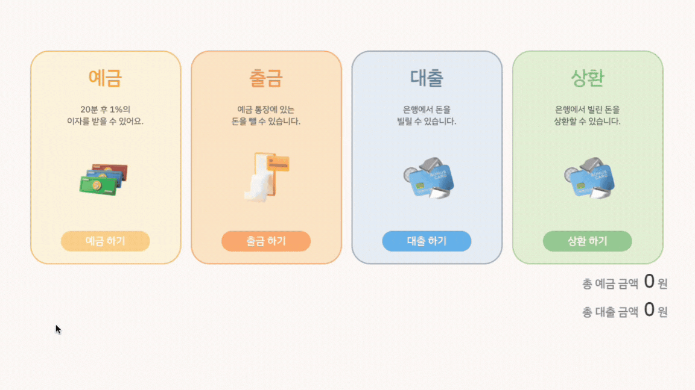

# MoneyVill - 메타버스 경제 시뮬레이션 서비스

 

## Table of Contents

[1. MoneyVill?](#1-MoneyVill)

[2. 시스템 구조도](#2-시스템-구조도)

[3. 주요 기능](#3-주요-기능)

&nbsp;&nbsp;&nbsp;&nbsp;&nbsp;&nbsp;&nbsp;&nbsp;[1) 메인 페이지](#1-메인-페이지)

&nbsp;&nbsp;&nbsp;&nbsp;&nbsp;&nbsp;&nbsp;&nbsp;[2) 모의 투자](#2-모의-투자)

&nbsp;&nbsp;&nbsp;&nbsp;&nbsp;&nbsp;&nbsp;&nbsp;[3) 언론사](#3-언론사)

&nbsp;&nbsp;&nbsp;&nbsp;&nbsp;&nbsp;&nbsp;&nbsp;[4) 금융](#4-금융)

&nbsp;&nbsp;&nbsp;&nbsp;&nbsp;&nbsp;&nbsp;&nbsp;[5) 퀴즈](#5-퀴즈)

 

 

 

## 1. MoneyVill?

- MoneyVill은 메타버스에서 경제를 쉽고 재밌게 체험할 수 있는 서비스입니다
- 경제 지식 습득을 위한 모의투자, 금융 기능 외 다양한 기능들을 제공합니다

 

### 1) 주제 선정 배경

> 최근 조사에 따르면 우리나라 학새들의 경제 이해력 수준이 전반적으로 낮은것으로 나타났습니다. 그의 원인으로 학교에서 제공하는 경제 교육은 이론 중심이기 때문에, 학생들의 입장에서는 실제로 와닿지 않는것이 문제였습니다. 그래서 학생들이 교실에서도 쉽고 재밌게 경제 지식을 습득할 수 있는 서비스를 제공하고자 했습니다.

 
 

## 2. 시스템 구조도

## 3. 주요 기능

### 1) 🌟 메인 페이지

* 다른 사람들과의 자산 순위를 확인할 수 있습니다. 
* 사용자의 보유 현금 금액과 주식 수익률을 확인할 수 있습니다.

 

### 2) 📊 모의 투자

> 인게임 날짜로 하루를 30초로 하여 짧은 시간에 다양한 투자 전략을 체험할 수 있습니다.

- 종목별로 현재 사용자가 원하는 만큼 매수/매도 가능합니다.
- 인게임 날짜에 맞춰 변하는 주식 및 환율 차트를 확인 할 수 있습니다. 
- 인게임 날짜별로 랜덤하게 4가지 종목이 제공됩니다.
  

 

### 3) 📰 언론사

> 주식 구매 전 정보를 제대로 확인해야 한다는 것을 배울 수 있습니다.

- 종목별 뉴스를 구매할 수 있습니다.
- 구매한 뉴스는 뉴스 스크랩을 통해 후에도 확인 가능합니다
  

 

 

### 4) 💵 금융

> 예금을 통한 안전한 투자를 배울 수 있습니다.

- 보유 현금에 대하여 예금/ 출금이 가능합니다.
- 일정 시간이 지나면 예금에 대한 이자를 받을 수 있습니다.
- 대출 및 상환이 가능합니다.

 

 

### 5) 🧐 퀴즈

> 다른 사람들과 함께 경제 관련 퀴즈를 풀 수 있습니다.

- 다른 금융 소득들과 다르게 경제 퀴즈를 풀며 근로 소득을 받을 수 있습니다.

 

 
